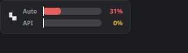
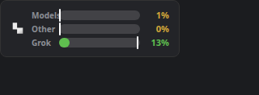
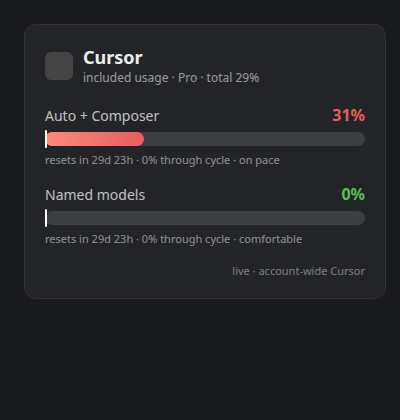

# Cursor Meter

> [!NOTE]
> **There's now one widget for all of them.** [AI Meter](https://github.com/matpb/ai-meter) shows Claude (any number of accounts), Codex, Grok and Cursor in a single KDE Plasma widget, with an optional Android home screen widget. New work happens there. This widget keeps working, and its reader script lives on inside AI Meter.

A KDE Plasma panel widget that shows your **live Cursor plan usage** as compact bars, colored by
how you're tracking against the clock.



Cursor meters **included usage** on a monthly billing cycle. The bars match the
[Spending page](https://cursor.com/dashboard/spending):

- **Models** — "Includes Cursor, Grok and Composer" (`autoModelSelectedDisplayMessage`, monthly)
- **Other** — "Other Models" (`namedModelSelectedDisplayMessage`, monthly)
- **Grok** — Grok Bot weekly pool (`GetSandUsageStatus`, resets every 7 days)

Hovering also shows **included allowance** — the dollar-weighted total from `displayMessage`
(`includedSpend ÷ limit`). That number is usually higher than the Models bar alone because it counts
usage across every pool in your monthly allowance, not just the Cursor/Grok/Composer slice.

### The Grok Bot bar

Plans with a Grok Bot weekly pool get a third window. It is always in the hover text and the popup.
In the panel it is off by default so the widget stays two bars tall; turn it on in **Configure →
Appearance → Bars in the panel** to get three bars, or swap the Other bar for Grok:



It reads `GetSandUsageStatus`, so it follows whatever weekly pool Cursor exposes next.

It reads your usage from the same dashboard endpoint the Cursor app uses, with the token Cursor
already put on your disk after you sign in. No browser, no cookies, no keyring. Always fresh, counts
usage from **every Cursor surface** (IDE, CLI, Cloud Agents), and costs **zero quota** — it's a
read-only status check, not a prompt.

---

## Who this is for

- You're on **KDE Plasma 6** (the widget is a Plasma applet). It is *KDE-only* — it won't work on
  GNOME, Xfce, etc.
- You use **Cursor** (IDE and/or `cursor-agent`) and you're signed in.
- You're on a **Pro, Pro+, Business, or Ultra** plan with included usage. Enterprise request-bucket
  accounts fall back to the legacy `/auth/usage` shape when the dashboard has no `planUsage`.

## What the bars tell you



Each bar packs four signals:

| Element | Meaning |
|---|---|
| **Fill length** | How much of that bucket you've used (`14%`). |
| **Vertical tick** | How far *through that window by time* you are. Fill **left** of the tick = under pace; fill **right** = burning fast. Models and Other share the monthly clock; Grok has its own weekly clock. |
| **Color** | Pace, not raw usage: **green** = comfortably under, **yellow** = right on the clock, **red** = ahead of the clock. |
| **↺ marker** | The cycle just reset — the live number may still be catching up. |

A bucket nobody has touched yet reads **"unused"** rather than `0%`, so you can tell a fresh cycle
from a frugal one.

Hover for exact numbers, reset countdowns and pace; click to open the detail popup.

When the reading is not live, the panel shows a **disconnected-plug badge reading “offline”** — the
live dashboard fetch failed and the bars are coming from the last successful live read on disk. If
that fallback also goes stale (older than ten minutes) the bars dim and the badge switches to a
clock with the reading's age.

## Requirements

- KDE Plasma **6**
- **Cursor** signed in — credentials at `~/.config/cursor/auth.json` (CLI) or the IDE state DB
- A Cursor subscription with included usage (Pro and above)
- CLI tools: `jq`, `curl`, `kpackagetool6` (`sqlite3` optional, for IDE-token fallback)

```bash
# Fedora KDE
sudo dnf install jq curl kf6-kpackage sqlite
# Arch
sudo pacman -S jq curl sqlite
# openSUSE
sudo zypper install jq curl sqlite3
```

## Install

```bash
git clone https://github.com/matpb/cursor-meter.git
cd cursor-meter
./install.sh
```

The installer registers the plasmoid and offers to drop it straight into your top panel. If you'd
rather add it by hand: right-click your panel → **Add Widgets…** → search **Cursor Meter**.

No configuration needed.

## How it works

1. Every ~90 seconds the widget runs its bundled reader (`contents/scripts/cursor-meter.sh`).
2. The reader takes the access token from `~/.config/cursor/auth.json` (written by `cursor-agent
   login`) or, if that's missing, `cursorAuth/accessToken` in the IDE's `state.vscdb`.
3. It calls `GetCurrentPeriodUsage` for the two monthly pools and `GetSandUsageStatus` for Grok Bot
   weekly usage, parsing the `*DisplayMessage` strings (and `usagePercent` for Grok). The raw
   `*PercentUsed` floats in the monthly response are internal metrics and do **not** match the web UI.
4. If the token has expired or the network is down, it falls back to the last successful live read
   cached at `~/.config/cursor-meter/last.json`.

The token is used **only in memory**, sent **only to api2.cursor.sh over HTTPS**, and is **never
logged**, never written. Nothing else is stored except the usage snapshot (percents and reset times,
no credentials).

### About the token

Cursor refreshes the token whenever the IDE or CLI runs, so in normal daily use it rarely goes
stale. Go long enough without opening Cursor and the live fetch stops; the widget quietly falls back
to the last cache, and one Cursor session puts it back. Cursor Meter deliberately does **not**
refresh the token itself — writing to `auth.json` would race with the CLI, which owns that file.

## Configuration (all optional)

| Variable | Purpose |
|---|---|
| `CURSOR_CONFIG_HOME` | CLI auth directory (default `~/.config/cursor`). |
| `CURSOR_STATE_DB` | IDE state DB path (default `~/.config/Cursor/User/globalStorage/state.vscdb`). |
| `CURSOR_METER_CACHE` | Snapshot path (default `~/.config/cursor-meter/last.json`). |
| `CURSOR_API_BASE` | API origin (default `https://api2.cursor.sh`). |
| `CURSOR_METER_DEBUG=1` | Print diagnostics to stderr — run the reader by hand to see why the live fetch fails. Never logs the token. |

## Bonus: a one-line status script

`extras/statusline.sh` prints a compact summary for shell hooks:

```
Cursor allowance 14% · Models 1% · Other 0% · Grok 13%
```

## Options

Right-click the widget → **Configure Cursor Meter…** → **Appearance**:

| Option | Default | What it does |
|---|---|---|
| **Show the Cursor icon** | on | Puts the Cursor mark in front of the bars. |
| **Tint it to match the panel** | off | Renders the mark in your panel's text colour instead of the brand colour. |
| **Show the window labels** | on | Turn off to reclaim panel width once the icon makes it obvious which widget is which. |
| **Bars in the panel** | Models and Other | Pick two or three bars: monthly pools only, all three pools, or Models + Grok Bot. The popup always shows every pool. |

## Uninstall

```bash
./uninstall.sh
```

Then right-click the widget in your panel → **Remove**.

## Troubleshooting

Run the reader by hand with diagnostics:

```bash
CURSOR_METER_DEBUG=1 ~/.local/share/plasma/plasmoids/org.mat.cursormeter/contents/scripts/cursor-meter.sh
```

- **No token** — sign in to the Cursor IDE or run `cursor-agent login`.
- **Access token expired** — open Cursor or run `cursor-agent` once.
- **Bars are dimmed with a clock, or an offline badge** — the live fetch failed and it's showing your last cached numbers.
- **Nothing updates** — restart the shell: `kquitapp6 plasmashell && kstart plasmashell`.

Run the fixture tests (no network):

```bash
./tests/test-cursor-meter.sh
```

## See also

[**Claude Meter**](https://github.com/matpb/claude-meter), [**Codex Meter**](https://github.com/matpb/codex-meter), and
[**Grok Meter**](https://github.com/matpb/grok-meter) — the same widget family for Claude, Codex and Grok usage.
All four are fully independent; run any combination.

## Disclaimer

This is an **unofficial** tool and is not affiliated with or endorsed by Cursor / Anysphere. It reads
an undocumented dashboard endpoint using your own credentials, which could change at any time. Use it
for your own account only.

## Icon

The bundled mark is used only to label which service the bars are reporting on. The trademark
belongs to Anysphere; this project is unaffiliated.

## License

MIT — see [LICENSE](LICENSE). Copyright © 2026 [Mathieu-Philippe Bourgeois](https://matpb.com).
